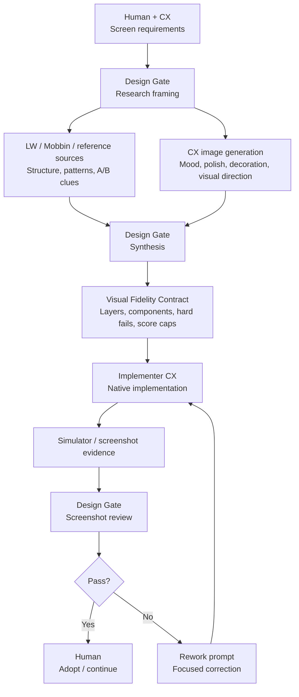

# CX Design Gate

CX Design Gate is a Codex plugin and skill for AI-driven UI design workflows. It separates project truth, visual contracts, implementation handoff, and screenshot-based design review so implementation agents do not treat build success or layout constraints as visual acceptance.

## Status

Early OSS plugin scaffold. The public API and workflow files may change before the first stable release.

## What This Plugin Provides

- A `design-gate` Codex skill for visual fidelity review workflows.
- Project Context Packet requirements for project-specific design truth.
- Minimal `design_direction` I/O contract so Project Agents do not have to restate reference workflow details.
- Evidence Board requirements for displaying reference screenshots, URLs, and identifiers before design proposals.
- Visual Fidelity Contract structure for concept art, screenshots, Lazyweb/Mobbin references, and implemented UI reviews.
- Hard Fail and Score Cap rules for preventing optimistic visual scoring.
- Role separation between Human, Project Agent, Designer CX, Architect CX, Implementer CX, and MCP reference services.
- Multi-agent orchestration guidance for separating implementation and visual review.
- Generic calibration examples that avoid project-specific data.

## Core Principle

Project-specific product truth stays in the project. This repository provides the reusable Design Gate procedure, schemas, prompts, and generic calibration patterns.

Project-local calibration cases should live outside this OSS package, for example:

```text
repo/.codex/cx-design-gate/calibration/
  index.md
  cases/
    <case-id>.md
```

## Required Workflow

Design Gate does not replace reference research or concept generation. For screen proposals, design directions, reference gates, and Visual Fidelity Contracts, it must run reference research before synthesis. It sits between requirements, research, concept exploration, implementation, and screenshot-based acceptance.



- Requirements define what the screen must do.
- LW and Mobbin are required live reference sources for new screen proposals, design directions, reference gates, and Visual Fidelity Contracts.
- If either LW or Mobbin is unavailable, Design Gate stops with `Reference research blocked` instead of proposing from requirements or calibration alone.
- LW, Mobbin, and other references provide real shipped UI patterns, structure, and experiment clues.
- CX image generation explores mood, polish, logo treatment, small decorative parts, and visual direction when the request or requirements call for concept evidence.
- Design Gate shows an Evidence Board and classifies references in a Reference Decision Matrix before synthesizing those inputs into design directions or a Visual Fidelity Contract.
- Implementation is accepted only after screenshot-based review passes hard fail rules and score caps.

## Repository Layout

```text
.codex-plugin/plugin.json
skills/design-gate/SKILL.md
skills/design-gate/references/
skills/design-gate/templates/
examples/generic/
```

## Skill Entry Point

Use the skill as `design-gate` in Codex. For `design_direction`, the skill accepts a Minimal Invocation Packet and resolves it into project context before doing reference research.

When installed through the local marketplace, the skill appears as `cx-design-gate:design-gate` in new Codex chats.

Typical flow:

```text
1. Project Agent collects project docs, screen requirements, references, and active calibration cases.
2. Design Gate runs Lazyweb and Mobbin reference research when creating design directions or contracts.
3. Design Gate creates an Evidence Board.
4. Design Gate creates a Reference Decision Matrix.
5. Design Gate creates design directions or reviews a Visual Fidelity Contract.
6. Implementer CX builds from the contract and returns screenshots/build evidence.
7. Designer CX applies hard fail rules and score caps.
8. Human makes the final pass/rework/stop decision.
```

Minimal `design_direction` invocation:

```yaml
request_type: design_direction
project_id: MN
target_screen: Home
requirements:
  paths:
    - docs/ops/tasks/.../home_skeleton.md
calibration:
  index_path: .codex/cx-design-gate/calibration/index.md
constraints:
  no_implementation: true
  no_spec_creation: true
  no_calibration_creation: true
```

The Project Agent should not prebuild live reference research, Evidence Board, Reference Decision Matrix, or design proposals. Design Gate owns that I/O contract.

## Validation

The plugin and skill were validated with the bundled Codex plugin/skill validation scripts. The local environment did not include PyYAML, so validation was run with a temporary local YAML shim instead of installing dependencies into the plugin.

The local plugin was also confirmed in a new Codex chat: `cx-design-gate:design-gate` appeared in Available skills and `SKILL.md` loaded successfully.

## License

MIT. See [LICENSE](LICENSE).
