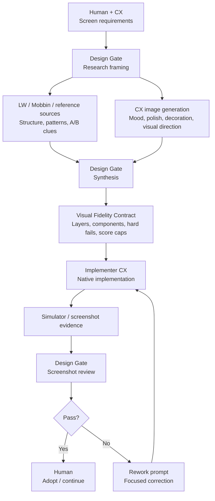

# CX Design Gate

CX Design Gate is a Codex plugin and skill for conversation-first AI-driven UI design workflows. It separates project truth, reference research, visual contracts, implementation handoff, and screenshot-based design review so implementation agents do not treat build success or layout constraints as visual acceptance.

## Status

Early OSS plugin scaffold. The public API and workflow files may change before the first stable release.

## What This Plugin Provides

- A `design-gate` Codex skill for visual fidelity review workflows.
- Project Context Packet requirements for project-specific design truth.
- Conversation-first I/O so Humans can give short direction without naming `request_type`.
- Default calibration discovery from `.codex/cx-design-gate/calibration/index.md`.
- Lazyweb Lane, Mobbin Lane, and Synthesis Lane outputs for reference comparison.
- Evidence Board requirements for displaying reference screenshots, URLs, and identifiers before design proposals.
- Visual Fidelity Contract structure for concept art, screenshots, Lazyweb/Mobbin references, and implemented UI reviews.
- State Capsule and Self-Review outputs for workflow continuity and guardrail checks.
- Version report behavior that links plugin version to CHANGELOG behavior.
- Hard Fail and Score Cap rules for preventing optimistic visual scoring.
- Role separation between Human, Project Agent, Designer CX, Architect CX, Implementer CX, and MCP reference services.
- Multi-agent handoff/review/rework contracts for separating implementation and visual review.
- Generic calibration examples that avoid project-specific data.

## Core Principle

Project-specific product truth stays in the project. This repository provides the reusable Design Gate procedure, schemas, prompts, and generic calibration patterns.

Project-local calibration cases should live outside this OSS package, for example:

```text
repo/.codex/cx-design-gate/calibration/
  index.md
  cases/
    <case-id>.md
```

## Required Workflow

Design Gate does not replace reference research or concept generation. For screen proposals, design directions, reference gates, and Visual Fidelity Contracts, it must run reference research before synthesis. It sits between requirements, research, concept exploration, implementation, and screenshot-based acceptance.



- Requirements define what the screen must do.
- LW and Mobbin are required live reference sources for new screen proposals, design directions, reference gates, and Visual Fidelity Contracts.
- If either LW or Mobbin is unavailable, Design Gate stops with `Reference research blocked` instead of proposing from requirements or calibration alone.
- Lazyweb and Mobbin are shown as separate lanes so their different strengths are visible before synthesis.
- Lazyweb provides flow, direction, hypothesis, pattern, and A/B-style clues.
- Mobbin provides shipped UI examples, component structure, density, spacing, and transition references.
- CX image generation explores mood, polish, logo treatment, small decorative parts, and visual direction when the request or requirements call for concept evidence.
- Design Gate shows Lazyweb Lane, Mobbin Lane, Evidence Board, Reference Decision Matrix, Synthesis Lane, State Capsule, and Self-Review before completing design directions or contracts.
- Implementation is accepted only after screenshot-based review passes hard fail rules and score caps.

## Repository Layout

```text
.codex-plugin/plugin.json
skills/design-gate/SKILL.md
skills/design-gate/references/
skills/design-gate/templates/
examples/generic/
```

## Skill Entry Point

Use the skill as `design-gate` in Codex. Humans should use short natural-language direction. `request_type` is an internal intent label and is not required for normal use.

When installed through the local marketplace, the skill appears as `cx-design-gate:design-gate` in new Codex chats.

Typical flow:

```text
1. Human gives direction and requirement paths.
2. Design Gate infers internal intent and resolves project context.
3. Design Gate runs Lazyweb and Mobbin in parallel lanes when required.
4. Design Gate creates Evidence Board, Reference Decision Matrix, and Synthesis Lane.
5. Design Gate returns the requested artifact plus State Capsule and Self-Review.
6. Implementer CX builds from the contract and returns screenshots/build evidence.
7. Designer CX applies hard fail rules and score caps.
8. Human makes the final pass/rework/stop decision.
```

Human should not repeat detailed workflow instructions such as Lazyweb/Mobbin usage, Evidence Board, Reference Decision Matrix, `request_type`, or no-mutation constraints. Design Gate owns those defaults.

## Human Prompt Examples

These examples are for Human/CX alignment. They are intentionally short; they are not meant to make Humans restate the whole workflow.

Screen direction:

```text
@cx-design-gate
MN Home の画面案を出してください。
requirements は docs/ops/tasks/.../home_skeleton.md を参照してください。
```

Visual polish:

```text
@cx-design-gate
Home 画面を、もう少し温かく、記録ノートらしい visual direction に寄せる案を出してください。
```

Implementation contract:

```text
@cx-design-gate
採用方向を実装前の Visual Fidelity Contract にしてください。
```

Implementer handoff:

```text
@cx-design-gate
この contract を Implementer CX に渡せる handoff にしてください。
```

Screenshot review:

```text
@cx-design-gate
このスクショを Visual Fidelity Contract に照らしてレビューし、修正指示を出してください。
```

Version report:

```text
@cx-design-gate
CXDG の version と CHANGELOG 上の現在挙動を表示してください。
```

Design Gate should output the relevant artifact plus:

- Lazyweb Lane
- Mobbin Lane
- Synthesis Lane
- State Capsule
- CXDG Self-Review
- next prompt candidate

## Versioning

`.codex-plugin/plugin.json` is the version source of truth. The first version heading in `CHANGELOG.md` must match it.

Use the version report prompt above to display:

- Plugin Version
- Changelog Section
- Recent Behavior Changes
- Version Consistency

If the plugin version and CHANGELOG heading differ, Design Gate reports `Version mismatch`.

## Validation

The plugin and skill were validated with the bundled Codex plugin/skill validation scripts. The local environment did not include PyYAML, so validation was run with a temporary local YAML shim instead of installing dependencies into the plugin.

The local plugin was also confirmed in a new Codex chat: `cx-design-gate:design-gate` appeared in Available skills and `SKILL.md` loaded successfully.

Version consistency can be checked with:

```bash
python3 scripts/check_version_consistency.py
```

## License

MIT. See [LICENSE](LICENSE).
